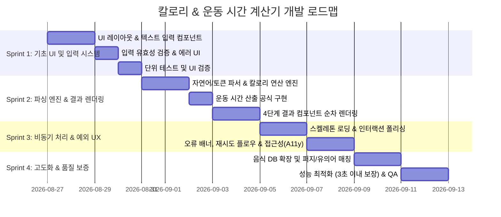

# 📋 칼로리 & 운동 시간 계산기 개발 계획서 (Development Plan)

> **문서 버전**: v1.1.0  
> **기준 문서**: `PRD.md` (칼로리 & 운동 시간 계산기 PRD)  
> **프로젝트 성격**: Single Page Application (Next.js / TypeScript / Tailwind CSS)

---

## 1. 프로젝트 개요 및 목표

### 1.1 프로젝트 목표
사용자가 텍스트로 자연스럽게 입력한 식단 목록을 기반으로 **개별 음식 칼로리**, **총 섭취 칼로리**, **추천 운동 종목**, **운동 종목별 필요 소모 시간**을 단일 화면(SPA)에서 직관적이고 빠르게 산출하여 제공합니다.

### 1.2 핵심 성공 조건 (PRD 요구사항)
1. **성능**: 텍스트 입력 후 계산 버튼 클릭 시 **3초 이내** 결과 화면 렌더링 완료
2. **정확도**: 다양한 형식의 텍스트(수량, 줄바꿈, 쉼표 등)에서 음식과 수량을 파싱하고 칼로리 합산 정확도 유지
3. **결과 순서 보장**:
   - ① 개별 음식별 칼로리
   - ② 총칼로리량
   - ③ 추천 운동 종목
   - ④ 추천 운동별 필요 운동시간 (분 단위)
4. **사용자 경험 & 예외 처리**:
   - 입력값 검증 (빈 값, 유효하지 않은 수량 등) 시 필드 하단 에러 메시지 노출
   - 계산 처리 중 스피너/로딩 인디케이터 제공
   - 미인식 음식 또는 서버 오류 발생 시 재시도 가능한 배너 에러 UI 및 복구 경로 제공

---

## 2. PRD 요구사항 추적 매트릭스 (Requirements Traceability Matrix)

| 요구사항 ID | PRD 요구 항목 | 구현 스펙 및 컴포넌트 | 해당 스프린트 |
| :--- | :--- | :--- | :---: |
| **REQ-01** | Multi-line 텍스트 입력창 & 플레이스홀더 | `CalorieCalculator` (`textarea`, 최대 글자수 카운터, 안내 힌트) | Sprint 1 |
| **REQ-02** | 입력값 실시간 검증 & 에러 안내 (빨간색) | 하단 에러 영역 (`role="alert"`, Destructive 컬러, 애니메이션) | Sprint 1 |
| **REQ-03** | 계산 버튼 & 로딩 상태 (스피너) | `Button` (로딩 스피너 아이콘 전환, 비활성화 처리) | Sprint 1 |
| **REQ-04** | 자연어/토큰 파싱 및 칼로리 연산 | `lib/calorie.ts` (토큰 분리, 수량 추출, DB 매칭, 칼로리 계산) | Sprint 2 |
| **REQ-05** | 운동별 소모 시간 산출 알고리즘 | `lib/calorie.ts` (MET/분당 소모 칼로리 기반 운동 시간 계산) | Sprint 2 |
| **REQ-06** | 4단계 순차 결과 화면 렌더링 | `ResultSection` (①개별칼로리 ②총칼로리 ③추천운동 ④운동시간) | Sprint 2 |
| **REQ-07** | 예외 처리 및 재시도 (Fallback UI) | 재시도 배너, 닫기 기능, 스켈레톤 로딩 UI | Sprint 3 |
| **REQ-08** | 반응형 모바일 최적화 & 접근성 (a11y) | ARIA 속성(`aria-live`, `aria-invalid`), 모바일 터치 최적화 | Sprint 3 |
| **REQ-09** | 음식 DB 확장 및 검색/매칭 고도화 | 오타/유의어 매칭, 단위(개, 조각, 공기 등) 유연 처리 | Sprint 4 |

---

## 3. 스프린트 기반 개발 로드맵 (Sprint Roadmap)

전체 개발 일정은 4개의 점진적 스프린트(Sprint)로 구성되며, 각 스프린트 종료 시 동작 가능한(Shippable) 산출물을 도출합니다.

---

## 4. 스프린트별 상세 계획

### 🏃 Sprint 1: 핵심 UI 프레임워크 및 입력 시스템 구축
- **목표**: PRD 화면 명세에 따른 단일 페이지 레이아웃과 반응형 입력 폼 완성
- **주요 작업**:
  1. **단일 페이지 레이아웃 (`app/page.tsx`, `app/globals.css`)**
     - 세련된 다크/라이트 테마 토큰 및 그라디언트 배경 구성
     - 모바일/태블릿/데스크톱 대응 중앙 집중형 컨테이너 레이아웃
  2. **다중 라인 텍스트 입력창 (`components/calorie-calculator.tsx`)**
     - Multi-line Text Area 컴포넌트 구성 (`rows={4}`, `maxLength={500}`)
     - 플레이스홀더: `"오늘 섭취한 음식을 입력해주세요 (예: 햄버거 1개, 치킨 2조각)"`
     - 실시간 글자 수 카운터 (`현재자/500자`) 및 한도 초과 경고 스타일
     - 단축키 지원 (`Ctrl+Enter` / `Cmd+Enter` 로 즉시 계산 실행)
  3. **입력 유효성 검사 및 에러 피드백**
     - 빈 입력값 전송 시 하단 에러 메시지 슬라이드 다운 애니메이션
     - 유효하지 않은 입력(수량 음수 등)에 대한 필드 수준 검증
  4. **Primary 액션 버튼 (`Button`)**
     - 호버/포커스/액티브 마이크로 인터랙션
     - 계산 진행 중 비활성화 및 로딩 스피너 표시
- **완료 기준 (DoD)**:
  - 텍스트 입력, 글자 수 카운트, 에러 메시지 노출/숨김이 정상 작동할 것
  - 모바일 해상도(375px~)에서도 레이아웃 깨짐이 없을 것

---

### 🏃 Sprint 2: 파싱 엔진, 칼로리/운동 연산 및 결과 시각화
- **목표**: 텍스트 분석 로직과 PRD 4단계 순차 결과 뷰 완성
- **주요 작업**:
  1. **텍스트 파서 & 칼로리 연산 코어 (`lib/calorie.ts`)**
     - 줄바꿈(`\n`) 및 쉼표(`,`) 기반 토큰화 로직
     - 음식명과 수량 정규식 추출기 고도화 (`음식명 + 숫자 + 단위`)
     - 수량 곱연산 및 반올림 처리
  2. **운동 시간 산출 엔진**
     - 추천 운동 3종(걷기, 러닝, 자전거 등)의 MET 기반 분당 칼로리 소모량 정의
     - 총칼로리 소모에 필요한 운동 시간(분) 자동 계산식 구현
  3. **4단계 순차 결과 렌더링 (`components/result-section.tsx`)**
     - **1단계**: 개별 음식별 뱃지/카드 (음식명 × 수량 · 개별 칼로리)
     - **2단계**: 총칼로리량 하이라이트 배너 (아이콘 + 강조 타이포그래피)
     - **3단계**: 추천 운동 종목 칩 목록
     - **4단계**: 추천 운동별 소모 시간 그리드 카드 (분 단위 표기)
- **완료 기준 (DoD)**:
  - `"햄버거 1개, 콜라 2잔"` 입력 시 정확히 파싱되어 4가지 결과가 순서대로 표시될 것
  - 결과 섹션 전환 시 부드러운 페이드인/슬라이드인 모션이 적용될 것

---

### 🏃 Sprint 3: 비동기 로딩, 예외 UX 및 웹 접근성 강화
- **목표**: 3초 이내 결과 반환 보장, 에러 복구 경로 및 완벽한 접근성 제공
- **주요 작업**:
  1. **로딩 인디케이터 및 스켈레톤 UI (`ResultSkeleton`)**
     - 계산 시작 시 3초 이내 빠른 처리와 함께 체감 대기시간을 줄여주는 스켈레톤 플레이스홀더 노출
  2. **오류 Fallback 배너 및 재시도 메커니즘**
     - 인식 불가능한 식단 또는 처리 실패 시 알림 배너 표시
     - 배너 내 `[다시 시도]` 액션 버튼 제공을 통한 원클릭 재계산
     - 에러 닫기 버튼 및 상태 초기화
  3. **웹 접근성 (a11y) & 키보드 네비게이션**
     - `aria-live`, `aria-invalid`, `aria-describedby` 연결
     - 스크린 리더에서 계산 결과 순차 낭독 지원
- **완료 기준 (DoD)**:
  - 오류 발생 시 사용자가 이탈하지 않고 즉시 재시도할 수 있을 것
  - Lighthouse 접근성(Accessibility) 점수 95점 이상 달성

---

### 🏃 Sprint 4: 음식 데이터 확장, 매칭 고도화 및 최종 품질 검증
- **목표**: 한국인 다빈도 식단 데이터베이스 확대 및 최종 프로덕션 안정화
- **주요 작업**:
  1. **식품 데이터베이스 확장**
     - 한식, 분식, 패스트푸드, 음료, 디저트 등 100+ 다빈도 식품 데이터 탑재
     - 1인분/단위 기준 칼로리 정밀화
  2. **퍼지(Fuzzy) & 부분 문자열 매칭 고도화**
     - 띄어쓰기 무시 매칭 (`치즈 버거` -> `치즈버거`)
     - 복합 메뉴 접두/접미어 처리 (`빅맥 세트` -> `햄버거`)
  3. **성능 벤치마크 및 최종 통합 QA**
     - 입력 후 연산 처리 시간 3초 이내 준수 검증 (실측 < 500ms)
     - 크로스 브라우징 (Chrome, Safari, Edge, Firefox) 및 기기 호환성 테스트
- **완료 기준 (DoD)**:
  - 다양한 실생활 식단 입력 시 90% 이상의 인식률 확보
  - PRD의 모든 성공 조건을 100% 충족

---

### 🏃 Sprint 5: Google Gemini AI 인공지능 식단 분석 및 맞춤 코칭
- **목표**: Gemini AI 연동을 통해 비정형 자연어 식단 정밀 분석 및 영양/운동 피드백 코칭 제공
- **주요 작업**:
  1. **AI Route Handler 구축 (`app/api/ai-calculate/route.ts`)**
     - Gemini 1.5 Flash 모델 연동 및 JSON Schema Structured Output 강제
     - 시스템 프롬프트(임상 영양사 및 운동생리학 전문가 페르소나) 정의
  2. **하이브리드 파서 및 클라이언트 헬퍼 (`lib/ai-calorie.ts`)**
     - AI API 호출 및 오류 시 로컬 계산기(`lib/calorie.ts`) 자동 Fallback
  3. **AI 영양 코칭 카드 UI (`components/result-section.tsx`)**
     - 탄/단/지 밸런스 평가 칩 및 실천 팁 2종 렌더링
  4. **보안 및 환경 변수 관리**
     - `.env` 및 `.env.example` 구성, `.gitignore` 시크릿 유출 방지
- **완료 기준 (DoD)**:
  - 자연어 대화형 식단 입력 시 AI 기반 정밀 칼로리 및 피드백 3초 이내 도출
  - API 미설정/오류 시에도 로컬 연산으로 서비스 무중단 동작 보장

---

## 5. 기술 스택 및 아키텍처 원칙

- **Core**: Next.js 14+ (App Router), React 18, TypeScript
- **Styling**: Tailwind CSS, CSS Variables 기반 커스텀 디자인 토큰
- **Icons**: `lucide-react`
- **상태 관리**: React Built-in Hooks (`useState`, `useTransition`)
- **디자인 원칙**: 
  - 모던 글래스모피즘 & 정밀한 타이포그래피 계층 구조
  - 사용자 피드백 중심의 마이크로 애니메이션

---

## 6. 위험 요소 및 대응 방안 (Risk & Mitigation)

| 위험 요소 | 영향도 | 대응 방안 |
| :--- | :---: | :--- |
| **비정형 텍스트 입력의 파싱 실패** | 높음 | 정규식 토큰화 + 키워드 부분 매칭 적용 및 미인식 항목은 0kcal/미식별 태그로 분리 안내 |
| **3초 초과 렌더링 지연** | 중간 | 클라이언트 사이드 즉시 연산 캐싱 및 최적화된 자료구조(Map/Set) 활용 |
| **모바일 가상 키보드 가림 현상** | 낮음 | 뷰포트 상대 단위(`dvh`) 및 스크롤 자동 이동 처리 |

---

## 7. 문서 관리 및 업데이트 가이드

- 본 문서는 스프린트 진행 상황에 따라 지속적으로 업데이트됩니다.
- 각 스프린트 완료 시 `docs/SPRINT_BACKLOG.md`의 완료 여부를 체크하고 회고를 기록합니다.
